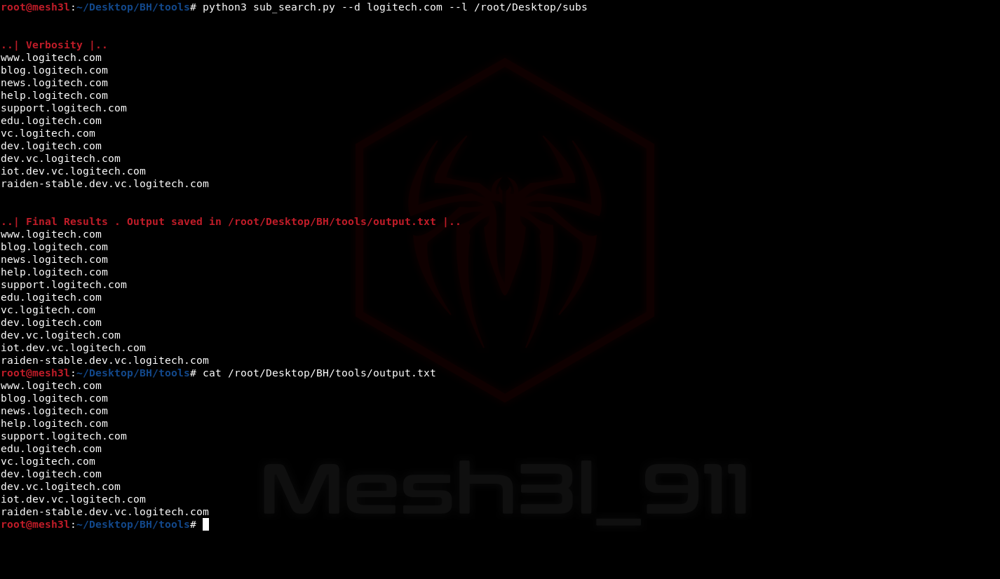

# Sub_Search v1.0 :

 <b>A tool that automates the process of getting all levels of subdomains that have A dns record by brute-forcing forward DNS lookup </b>
 
 
   

# Installation : 
 <code>git clone https://github.com/Mesh3l911/sub_search.git</code>
 

# Usage :
 
<code>python3 sub_search.py --d domain.com --l <Your_SubDomains_List></code>
 

 # POC :
 <code>https://youtu.be/SLzJJclo4yY</code>
  

# Happy Hunting ^_^ 
